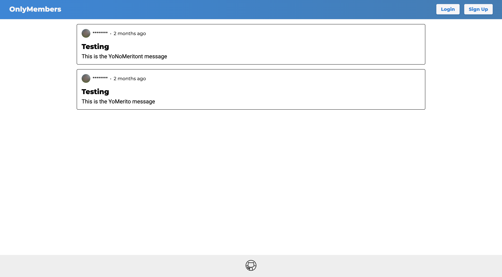
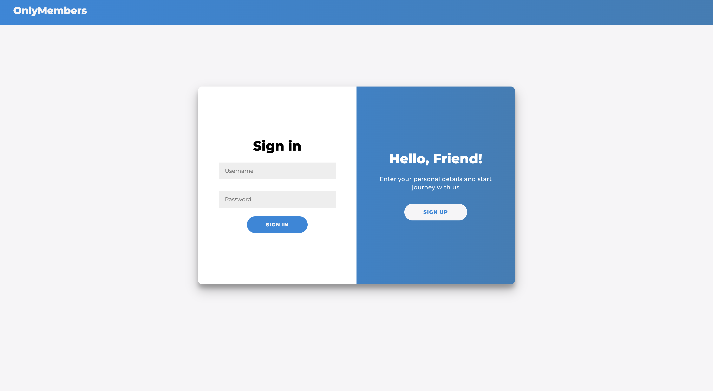
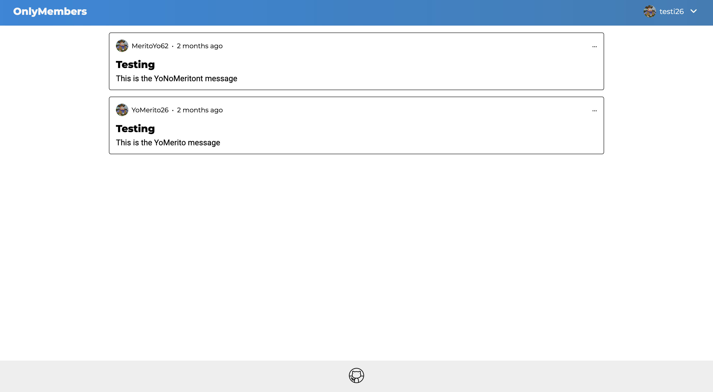

# Members Only Project

A web application built with **Node.js**, **Express**, **PostgreSQL**, **Passport.js**, and **bcrypt**, allowing users to sign up, become members, and post messages in a private club. Admin users have additional privileges, including deleting messages.


## Installation

Follow these steps to run the project locally:

1. **Clone the repository**
   ```bash
   git clone git@github.com:Maiker260/Members-Only.git
   ```

2. **Install dependencies**
   ```bash
   cd Members-Only
   npm install
   ```

3.	Configure environment variables
   Create a .env file with:

   ```bash
   DATABASE_URL="DB-URL
   SESSIONPWD=“Session-Password“
   ADMINPWD=“Admin-Password”
```

4. Setup Prisma

   ```bash
   npx prisma migrate dev --name init
   npx prisma generate
   ```

5. **Build and run**
   ```bash
   npm run devStart
   ```

6. **Open the app**  
    
## Features


**Users**
- Users have the following attributes:
  - **Full Name** (first and last)
  - **Username** (email)
  - **Password** (hashed with bcrypt)
  - **Membership Status** (true/false)
  - *(Optional)* **Admin** flag
- Membership status is not granted on sign-up; users must join the club using a **secret passcode**.
- Admin users can delete messages.

**Authentication**
- Sign-up form with:
  - Password confirmation and custom validation
  - Field sanitization
  - Password hashing using **bcrypt**
- Login using **Passport.js**
- Only logged-in users can create messages or join the club.

**Messages**
- Messages have:
  - **Title**
  - **Timestamp**
  - **Text**
  - Linked to the user who created it
- Logged-in members can see:
  - Author name
  - Date of the message
- Non-members can see messages but **author and date are hidden**.
- Admin users can delete messages.

**Membership**
- Users can enter a **secret passcode** to gain membership status.
- Optional admin passcode or checkbox grants **admin privileges**.

**Permissions**
- Non-members: view messages anonymously.
- Members: view author and timestamp.
- Admins: view everything and delete messages.

## Demo

https://members-only-h8am.onrender.com/

## Screenshots

Main Page


Login-SignUp


Home Page


## Acknowledgements

- [Node.js](https://nodejs.org/)
- [Express](https://expressjs.com/)
- [PostgreSQL](https://www.postgresql.org/)
- [Passport.js](http://www.passportjs.org/)
- [bcrypt](https://www.npmjs.com/package/bcrypt)
- MDN Web Docs for guidance on authentication and security practices


## Author

- [@Maiker260](https://github.com/Maiker260)